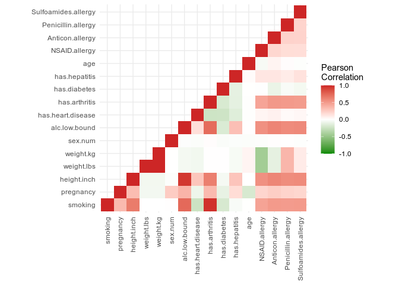
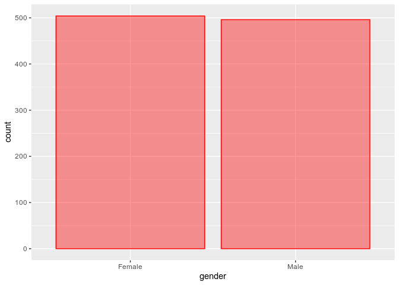
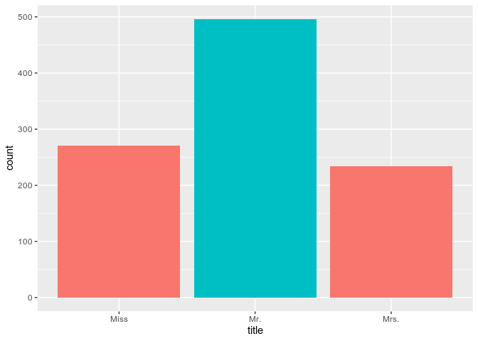
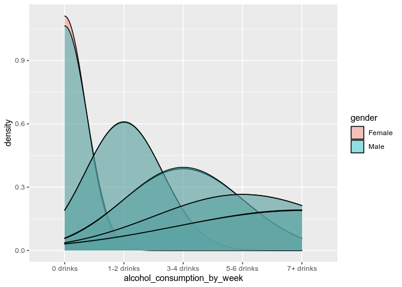
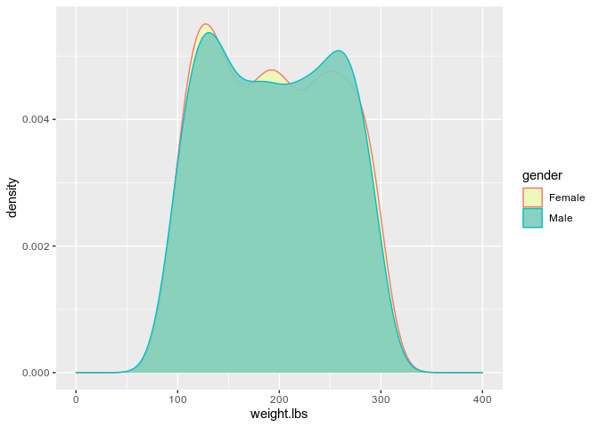
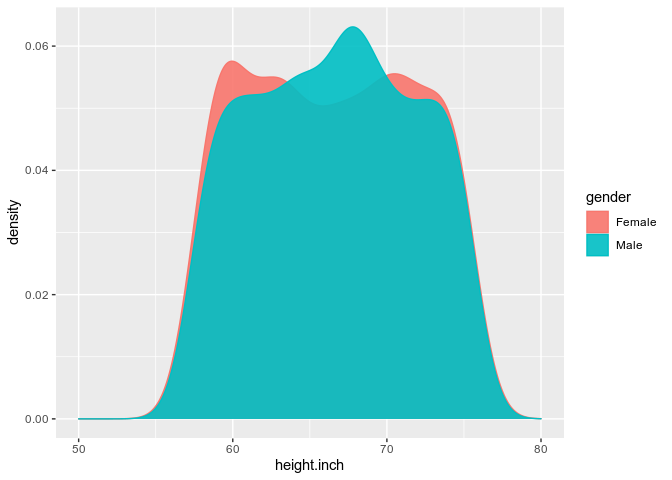

# Patient Data Cleaning Project


### Load in libraries and read data

```r
library(dplyr)
```

```
## 
## Attaching package: 'dplyr'
```

```
## The following objects are masked from 'package:stats':
## 
##     filter, lag
```

```
## The following objects are masked from 'package:base':
## 
##     intersect, setdiff, setequal, union
```

```r
library(ggplot2)
library(tidyr)
library(stringr)
library(reshape2)
```

```
## 
## Attaching package: 'reshape2'
```

```
## The following object is masked from 'package:tidyr':
## 
##     smiths
```

```r
library(lubridate)
```

```
## 
## Attaching package: 'lubridate'
```

```
## The following objects are masked from 'package:dplyr':
## 
##     intersect, setdiff, union
```

```
## The following objects are masked from 'package:base':
## 
##     date, intersect, setdiff, union
```

```r
library(plotly)
```

```
## 
## Attaching package: 'plotly'
```

```
## The following object is masked from 'package:ggplot2':
## 
##     last_plot
```

```
## The following object is masked from 'package:stats':
## 
##     filter
```

```
## The following object is masked from 'package:graphics':
## 
##     layout
```

```r
p_df <- read.csv('patient_data.csv')
```


## Task 2
Create an age column that calculates how old the patients would have been May, 5 2019.

This function uses lubridate to convert string values into date objects and then period objects.
The period is given in years. 

```r
calc_age <- function(df) {
  
  # Convert dates to intervals and calculate the period
  age <- as.period(interval(start = as.Date(mdy(df$dob)), end = as.Date(mdy('05/05/2019'))))$year
  
  return(mutate(df, age))
}
```

## Task 3
Make a column "adult" that shows if a patient is an adult, 19 or older, (1) or underage (0).
This function uses dplyer to apply different logical expressions to the dataframe. 

```r
calc_adult <- function(df) {
  
  age.bin <- if_else(df['age'] >= 19, 1, 0, -1)

  return(mutate(df, age.bin))
}
```

## Task 4
Create a column that reflects the following bins of their ages
* < 19
* 19-25
* 26-35
* 36-45
* > 45

Again, dplyr is used to apply a sequence of logical expressions to the data. 

```r
calc_age_bins <- function(df) {
  
  age.bins <- case_when(df['age'] < 19 ~ '< 19',
                        df['age'] >= 19 & df['age'] <= 25 ~ '19-25',
                        df['age'] >= 26 & df['age'] <= 35 ~ '26-35',
                        df['age'] >= 36 & df['age'] <= 45 ~ '36-45',
                        df['age'] > 45 ~ '> 45')
  
  return(mutate(df, age.bins))
}
```

## Task 5
Create one column with the patient's weight in kg and another in lbs.
Round kg to one decimal place and lbs to the nearest whole number.

The apply function is used to pass each record to stringr to check if the string is representing kilograms or pounds.
The rs function removes the unit suffix from each string, and transforms the string into a numerical value so it can be converted.

```r
# Removes weight suffix and returns as numeric
rs <- function(str) {
  return(as.numeric(sub('  kg|  lbs','\\1', str, perl = T)))
}

weight_norm <- function(df) {
  
  # Convert kg to lbs
  weight.lbs <- apply(df['weight'], 1, function(x){if_else(str_sub(x, -3) == 'lbs', rs(x), round(rs(x) * 2.205), -1)})
  
  # Convert lbs to kg
  weight.kg <- apply(df['weight'], 1, function(x){if_else(str_sub(x, -2) == 'kg', rs(x), round(rs(x) / 2.205, 1), -1)})
  
  return(mutate(df, weight.lbs, weight.kg))
  
}
```

## Task 6
Add a variable "height_in" that is an integer of their height in inches.

The height column is separated into two vectors and the feet columns is multiplied by 12.
The two vectors are then added together. 

```r
height_to_inch <- function(df) {
  
  # Separate height into 2 columns
  temp_df <- separate(df['height'], height, into = c('feet', 'inches', NA),  sep = "'|\"")
  
  # Convert feet to inches and add remaining inches
  height.inch <- apply(temp_df,1, function(x){12 * as.numeric(x[1]) + as.numeric(x[2])})
  
  # Mutate original dataframe
  return(mutate(df, height.inch))
}
```


## Task 7
Create new columns for each allergy. If a patient has the allergy, put a 1 into the corresponding row.

The grepl function is used to check if the allergy appears in the allergies column. 

```r
calc_allergies <- function(df) {
  
  # Find rows containing allergies
  NSAID.allergy <- if_else(grepl('NSAIDs', df$allergies), 1, 0, -1)
  Anticon.allergy <- if_else(grepl('Anticonvulsants', df$allergies), 1, 0, -1)
  Penicillin.allergy <- if_else(grepl('Penicillin', df$allergies), 1, 0, -1)
  Sulfoamides.allergy <- if_else(grepl('Sulfonamides', df$allergies), 1, 0, -1)
  
  return(mutate(df, NSAID.allergy, Anticon.allergy, Penicillin.allergy, Sulfoamides.allergy))
}
```

## Miscellaneous functions for generating numeric data
* Sex to numeric: Male = 0 and Female = 1
* Alcohol lower bound: contains only the lower number of the alcohol consumption column
* Health conditions to numeric: All health conditions have their separate column where 1 means the patient has the condition and 0 means they do not.

```r
# Change sex to numeric
sex_num <- function(df) {
  sex.num <- if_else(df['gender'] == 'Female', 1, 0, -1)
  return(mutate(df, sex.num))
}

# Alcohol consumption lower bound
alc_low_bound <- function(df) {
  alc.low.bound <- as.numeric(str_sub(df$alcohol_consumption_by_week, 1,1))
  return(mutate(df, alc.low.bound))
}

# Health conditions to numeric
health_con_num <- function(df) {
  has.heart.disease <- if_else(df['health_condition'] == 'Heart disease', 1, 0, -1)
  has.arthritis <- if_else(df['health_condition'] == 'Arthritis', 1, 0, -1)
  has.diabetes <- if_else(df['health_condition'] == 'Diabetes', 1, 0, -1)
  has.hepatitis <- if_else(df['health_condition'] == 'Hepatitis', 1, 0, -1)
  
  
  return(mutate(df, has.heart.disease, has.arthritis, has.diabetes, has.hepatitis))
}
```

## Run all functions on data

```r
p_data <- height_to_inch(p_df)
p_data <- weight_norm(p_data)
p_data <- sex_num(p_data)
p_data <- alc_low_bound(p_data)
p_data <- health_con_num(p_data)
p_data <- health_con_num(p_data)
p_data <- calc_age(p_data)
p_data <- calc_adult(p_data)
p_data <- calc_age_bins(p_data)
p_data <- calc_allergies(p_data)
```

## Task 1: Visualizations

# Correlation Matrix and create a correlation heatmap

```r
cor_mat <- cor(p_data %>% select(10,14:24,27:30))
cor_mat[upper.tri(cor_mat)] <- NA

melted_cor_mat <- melt(cor_mat, na.rm = T)

ggplot(data = melted_cor_mat, aes(x=Var1, y=Var2, fill=value)) + 
  geom_tile() +
  scale_fill_gradient2(low = 'green4', high = 'firebrick3', mid = 'white', midpoint = 0, limit = c(-1,1), space = 'Lab', name = 'Pearson\nCorrelation') +
  theme_minimal() +
  theme(axis.text.x = element_text(angle = 90, vjust = 0.5, hjust=1), axis.title = element_blank()) +
  coord_fixed()
```

<!-- -->

# Barplot of sex and titles

```r
ggplot(p_data, aes(gender)) + geom_bar(color='red', fill='red', alpha=0.4)
```

<!-- -->

```r
ggplot(p_data, aes(x=title, fill= gender)) + geom_bar() + theme(legend.position = 'none')
```

<!-- -->
# Density plot of alcohol consumption

```r
ggplot(p_data, aes(x=alcohol_consumption_by_week, fill=gender)) + geom_density(alpha=0.4)
```

<!-- -->
r
# Density plot of weight by sex

```r
ggplot(p_data, aes(x=weight.lbs, fill=gender, color=gender)) + geom_density(alpha=0.9) + xlim(0, 400) + scale_fill_brewer(palette = 'YlGnBu')
```

<!-- -->

# Density plot of height by sex

```r
ggplot(p_data, aes(x=height.inch, fill=gender, color=gender)) + geom_density(alpha=0.9) + xlim(50,80)
```

<!-- -->

# Task 8
Identify patients with heart diesase for drug trials.
 - Not pregnant
 - age 19-45
 - BMI between 21-29
 - Cannot have allergy to NSAIDs
 - Must have heart disease
 - Must be a non-smoker
 - Cannot have more than 7 drinks a week
 
The filter function from dplyr is used to choose only the records which fulfill the requirements.
The resulting dataframe is then saved as a csv file to the current working directory.

```r
calculate_bmi <- function(df) {
  
  # Calculate bmi using English System units
  bmi <- (df$weight.lbs / df$height.inch^2) * 703
  
  return(mutate(df, bmi))
}

identify_subjects <- function(df) {
  
  # Filter patients based on criteria
  subjects <- filter(df, 
                     pregnancy == 0,
                     age >= 19 & age <= 45,
                     bmi >= 21.0 & bmi <= 29.0,
                     NSAID.allergy == FALSE,
                     has.heart.disease == TRUE,
                     smoking == 0,
                     alc.low.bound != 7)
  
  return(subjects)
}

p_data <- calculate_bmi(p_data)
subjects_df <- identify_subjects(p_data)

# Write results to csv file
setwd("~/Documents/CATCH/R_cleaning_patient")
write.csv(subjects_df, file='eligible_patients.csv', row.names = FALSE)
```

## Extra Task: Try out plotly

Updated heatmap with plotly, replaced weight with BMI

```r
cor_mat <- cor(p_data %>% select(10,14, 18:24, 27:31))
cor_mat[upper.tri(cor_mat)] <- NA

plot_ly(x=colnames(cor_mat), y=rownames(cor_mat), z = cor_mat, type = 'heatmap', colorscale = 'RdBu', colorbar = list(title = 'Pearson\nCorrelation'))
```

<!--html_preserve--><div id="htmlwidget-04766263538395af67d5" style="width:672px;height:480px;" class="plotly html-widget"></div>
<script type="application/json" data-for="htmlwidget-04766263538395af67d5">{"x":{"visdat":{"18a960a8fca":["function () ","plotlyVisDat"]},"cur_data":"18a960a8fca","attrs":{"18a960a8fca":{"x":["smoking","pregnancy","sex.num","alc.low.bound","has.heart.disease","has.arthritis","has.diabetes","has.hepatitis","age","NSAID.allergy","Anticon.allergy","Penicillin.allergy","Sulfoamides.allergy","bmi"],"y":["smoking","pregnancy","sex.num","alc.low.bound","has.heart.disease","has.arthritis","has.diabetes","has.hepatitis","age","NSAID.allergy","Anticon.allergy","Penicillin.allergy","Sulfoamides.allergy","bmi"],"z":[[1,null,null,null,null,null,null,null,null,null,null,null,null,null],[0.342191692145462,1,null,null,null,null,null,null,null,null,null,null,null,null],[0.00439771662167614,0.25284693377376,1,null,null,null,null,null,null,null,null,null,null,null],[0.738946576618629,0.374603030978914,-0.013411492894598,1,null,null,null,null,null,null,null,null,null,null],[-0.245076468575408,-0.0787576725441778,-0.0186494773813429,0.158554623072336,1,null,null,null,null,null,null,null,null,null],[0.967781927749626,0.344654885351033,0.0128752675390772,0.727421801649848,-0.237180577203979,1,null,null,null,null,null,null,null,null],[-0.19314360581419,-0.1091615304782,-0.0227691546046151,-0.17531044938701,-0.232753525507436,-0.186920891167371,1,null,null,null,null,null,null,null],[-0.0327040149308454,0.171472926953598,-0.0177035220946505,0.31705651088019,-0.151373911570531,-0.121566134770966,-0.119297063797599,1,null,null,null,null,null,null],[-0.00201688413306709,-0.191404790374163,-0.0202066652271423,0.00557565736987447,-0.00708244077332494,-0.00637539978719839,0.00235492709170495,0.0213566921770609,1,null,null,null,null,null],[0.460708750033503,0.209340751041593,-0.0161708369325262,0.552332435406481,0.0492513425240697,0.451943377623475,-0.00535193177292559,0.123507236382862,-0.0394310785202747,1,null,null,null,null],[0.505480520304761,0.244740531643827,0.00761116556232866,0.609943246270719,0.0686471891035049,0.515473574135824,-0.0958904685869278,0.122794927482519,0.0550040270488985,0.197511185837791,1,null,null,null],[0.496701554976192,0.216093142402632,0.00349159797669889,0.576702892375004,0.0239261108582961,0.505952380952381,-0.0331633839167916,0.0962398566936816,0.0140398148319178,0.166704297075326,0.221759798484061,1,null,null],[0.504551247877814,0.201627189336265,-0.00724621561166027,0.586579202444771,0.0395585553818945,0.494852681556845,-0.054379065597928,0.142771820828443,-0.0117100191628466,0.166002527747374,0.217296287568359,0.213636840495907,1,null],[-0.267437437525519,-0.180039904801693,0.00926317127978563,-0.457854040217449,-0.197148644411335,-0.257369473467274,-0.00116788300085875,-0.156924542783259,0.0434233681821969,-0.597615737515629,-0.360513154909941,0.0459130326412747,-0.172353203297513,1]],"colorscale":"RdBu","colorbar":{"title":"Pearson<br />Correlation"},"alpha_stroke":1,"sizes":[10,100],"spans":[1,20],"type":"heatmap"}},"layout":{"margin":{"b":40,"l":60,"t":25,"r":10},"xaxis":{"domain":[0,1],"automargin":true,"title":[]},"yaxis":{"domain":[0,1],"automargin":true,"title":[]},"scene":{"zaxis":{"title":[]}},"hovermode":"closest","showlegend":false,"legend":{"yanchor":"top","y":0.5}},"source":"A","config":{"showSendToCloud":false},"data":[{"colorbar":{"title":"Pearson<br />Correlation","ticklen":2,"len":0.5,"lenmode":"fraction","y":1,"yanchor":"top"},"colorscale":"RdBu","showscale":true,"x":["smoking","pregnancy","sex.num","alc.low.bound","has.heart.disease","has.arthritis","has.diabetes","has.hepatitis","age","NSAID.allergy","Anticon.allergy","Penicillin.allergy","Sulfoamides.allergy","bmi"],"y":["smoking","pregnancy","sex.num","alc.low.bound","has.heart.disease","has.arthritis","has.diabetes","has.hepatitis","age","NSAID.allergy","Anticon.allergy","Penicillin.allergy","Sulfoamides.allergy","bmi"],"z":[[1,null,null,null,null,null,null,null,null,null,null,null,null,null],[0.342191692145462,1,null,null,null,null,null,null,null,null,null,null,null,null],[0.00439771662167614,0.25284693377376,1,null,null,null,null,null,null,null,null,null,null,null],[0.738946576618629,0.374603030978914,-0.013411492894598,1,null,null,null,null,null,null,null,null,null,null],[-0.245076468575408,-0.0787576725441778,-0.0186494773813429,0.158554623072336,1,null,null,null,null,null,null,null,null,null],[0.967781927749626,0.344654885351033,0.0128752675390772,0.727421801649848,-0.237180577203979,1,null,null,null,null,null,null,null,null],[-0.19314360581419,-0.1091615304782,-0.0227691546046151,-0.17531044938701,-0.232753525507436,-0.186920891167371,1,null,null,null,null,null,null,null],[-0.0327040149308454,0.171472926953598,-0.0177035220946505,0.31705651088019,-0.151373911570531,-0.121566134770966,-0.119297063797599,1,null,null,null,null,null,null],[-0.00201688413306709,-0.191404790374163,-0.0202066652271423,0.00557565736987447,-0.00708244077332494,-0.00637539978719839,0.00235492709170495,0.0213566921770609,1,null,null,null,null,null],[0.460708750033503,0.209340751041593,-0.0161708369325262,0.552332435406481,0.0492513425240697,0.451943377623475,-0.00535193177292559,0.123507236382862,-0.0394310785202747,1,null,null,null,null],[0.505480520304761,0.244740531643827,0.00761116556232866,0.609943246270719,0.0686471891035049,0.515473574135824,-0.0958904685869278,0.122794927482519,0.0550040270488985,0.197511185837791,1,null,null,null],[0.496701554976192,0.216093142402632,0.00349159797669889,0.576702892375004,0.0239261108582961,0.505952380952381,-0.0331633839167916,0.0962398566936816,0.0140398148319178,0.166704297075326,0.221759798484061,1,null,null],[0.504551247877814,0.201627189336265,-0.00724621561166027,0.586579202444771,0.0395585553818945,0.494852681556845,-0.054379065597928,0.142771820828443,-0.0117100191628466,0.166002527747374,0.217296287568359,0.213636840495907,1,null],[-0.267437437525519,-0.180039904801693,0.00926317127978563,-0.457854040217449,-0.197148644411335,-0.257369473467274,-0.00116788300085875,-0.156924542783259,0.0434233681821969,-0.597615737515629,-0.360513154909941,0.0459130326412747,-0.172353203297513,1]],"type":"heatmap","xaxis":"x","yaxis":"y","frame":null}],"highlight":{"on":"plotly_click","persistent":false,"dynamic":false,"selectize":false,"opacityDim":0.2,"selected":{"opacity":1},"debounce":0},"shinyEvents":["plotly_hover","plotly_click","plotly_selected","plotly_relayout","plotly_brushed","plotly_brushing","plotly_clickannotation","plotly_doubleclick","plotly_deselect","plotly_afterplot","plotly_sunburstclick"],"base_url":"https://plot.ly"},"evals":[],"jsHooks":[]}</script><!--/html_preserve-->


```r
bmi1 <- p_data[which(p_data$gender == 'Male'), ]
den1 <- density(bmi1$bmi)

bmi2 <- p_data[which(p_data$gender == 'Female'), ]
den2 <- density(bmi2$bmi)

plot_ly(x = ~den1$x, y = ~den1$y, type = 'scatter', mode = 'lines', fill = 'tozeroy', name = 'Male') %>%
  add_trace(x = ~den2$x, y = ~den2$y, fill = 'tozeroy', name = 'Female') %>%
  layout(xaxis = list(title = 'BMI'), yaxis = list(title = 'Density'))
```

<!--html_preserve--><div id="htmlwidget-93c747cfb6eae2941e71" style="width:672px;height:480px;" class="plotly html-widget"></div>
<script type="application/json" data-for="htmlwidget-93c747cfb6eae2941e71">{"x":{"visdat":{"18a918dbf569":["function () ","plotlyVisDat"]},"cur_data":"18a918dbf569","attrs":{"18a918dbf569":{"x":{},"y":{},"mode":"lines","fill":"tozeroy","name":"Male","alpha_stroke":1,"sizes":[10,100],"spans":[1,20],"type":"scatter"},"18a918dbf569.1":{"x":{},"y":{},"mode":"lines","fill":"tozeroy","name":"Female","alpha_stroke":1,"sizes":[10,100],"spans":[1,20],"type":"scatter","inherit":true}},"layout":{"margin":{"b":40,"l":60,"t":25,"r":10},"xaxis":{"domain":[0,1],"automargin":true,"title":"BMI"},"yaxis":{"domain":[0,1],"automargin":true,"title":"Density"},"hovermode":"closest","showlegend":true},"source":"A","config":{"showSendToCloud":false},"data":[{"fillcolor":"rgba(31,119,180,0.5)","x":[2.73983222337717,2.87399784872706,3.00816347407694,3.14232909942683,3.27649472477671,3.4106603501266,3.54482597547649,3.67899160082637,3.81315722617626,3.94732285152615,4.08148847687603,4.21565410222592,4.34981972757581,4.48398535292569,4.61815097827558,4.75231660362547,4.88648222897535,5.02064785432524,5.15481347967513,5.28897910502501,5.4231447303749,5.55731035572478,5.69147598107467,5.82564160642456,5.95980723177444,6.09397285712433,6.22813848247422,6.3623041078241,6.49646973317399,6.63063535852388,6.76480098387376,6.89896660922365,7.03313223457354,7.16729785992342,7.30146348527331,7.4356291106232,7.56979473597308,7.70396036132297,7.83812598667285,7.97229161202274,8.10645723737263,8.24062286272251,8.3747884880724,8.50895411342229,8.64311973877217,8.77728536412206,8.91145098947195,9.04561661482183,9.17978224017172,9.31394786552161,9.44811349087149,9.58227911622138,9.71644474157127,9.85061036692115,9.98477599227104,10.1189416176209,10.2531072429708,10.3872728683207,10.5214384936706,10.6556041190205,10.7897697443704,10.9239353697202,11.0581009950701,11.19226662042,11.3264322457699,11.4605978711198,11.5947634964697,11.7289291218196,11.8630947471694,11.9972603725193,12.1314259978692,12.2655916232191,12.399757248569,12.5339228739189,12.6680884992688,12.8022541246187,12.9364197499685,13.0705853753184,13.2047510006683,13.3389166260182,13.4730822513681,13.607247876718,13.7414135020679,13.8755791274177,14.0097447527676,14.1439103781175,14.2780760034674,14.4122416288173,14.5464072541672,14.6805728795171,14.814738504867,14.9489041302168,15.0830697555667,15.2172353809166,15.3514010062665,15.4855666316164,15.6197322569663,15.7538978823162,15.888063507666,16.0222291330159,16.1563947583658,16.2905603837157,16.4247260090656,16.5588916344155,16.6930572597654,16.8272228851152,16.9613885104651,17.095554135815,17.2297197611649,17.3638853865148,17.4980510118647,17.6322166372146,17.7663822625645,17.9005478879143,18.0347135132642,18.1688791386141,18.303044763964,18.4372103893139,18.5713760146638,18.7055416400137,18.8397072653635,18.9738728907134,19.1080385160633,19.2422041414132,19.3763697667631,19.510535392113,19.6447010174629,19.7788666428128,19.9130322681626,20.0471978935125,20.1813635188624,20.3155291442123,20.4496947695622,20.5838603949121,20.718026020262,20.8521916456118,20.9863572709617,21.1205228963116,21.2546885216615,21.3888541470114,21.5230197723613,21.6571853977112,21.791351023061,21.9255166484109,22.0596822737608,22.1938478991107,22.3280135244606,22.4621791498105,22.5963447751604,22.7305104005103,22.8646760258601,22.99884165121,23.1330072765599,23.2671729019098,23.4013385272597,23.5355041526096,23.6696697779595,23.8038354033093,23.9380010286592,24.0721666540091,24.206332279359,24.3404979047089,24.4746635300588,24.6088291554087,24.7429947807586,24.8771604061084,25.0113260314583,25.1454916568082,25.2796572821581,25.413822907508,25.5479885328579,25.6821541582078,25.8163197835576,25.9504854089075,26.0846510342574,26.2188166596073,26.3529822849572,26.4871479103071,26.621313535657,26.7554791610068,26.8896447863567,27.0238104117066,27.1579760370565,27.2921416624064,27.4263072877563,27.5604729131062,27.6946385384561,27.8288041638059,27.9629697891558,28.0971354145057,28.2313010398556,28.3654666652055,28.4996322905554,28.6337979159053,28.7679635412551,28.902129166605,29.0362947919549,29.1704604173048,29.3046260426547,29.4387916680046,29.5729572933545,29.7071229187043,29.8412885440542,29.9754541694041,30.109619794754,30.2437854201039,30.3779510454538,30.5121166708037,30.6462822961536,30.7804479215034,30.9146135468533,31.0487791722032,31.1829447975531,31.317110422903,31.4512760482529,31.5854416736028,31.7196072989526,31.8537729243025,31.9879385496524,32.1221041750023,32.2562698003522,32.3904354257021,32.524601051052,32.6587666764019,32.7929323017517,32.9270979271016,33.0612635524515,33.1954291778014,33.3295948031513,33.4637604285012,33.5979260538511,33.7320916792009,33.8662573045508,34.0004229299007,34.1345885552506,34.2687541806005,34.4029198059504,34.5370854313003,34.6712510566501,34.805416682,34.9395823073499,35.0737479326998,35.2079135580497,35.3420791833996,35.4762448087495,35.6104104340994,35.7445760594492,35.8787416847991,36.012907310149,36.1470729354989,36.2812385608488,36.4154041861987,36.5495698115486,36.6837354368984,36.8179010622483,36.9520666875982,37.0862323129481,37.220397938298,37.3545635636479,37.4887291889978,37.6228948143477,37.7570604396975,37.8912260650474,38.0253916903973,38.1595573157472,38.2937229410971,38.427888566447,38.5620541917969,38.6962198171467,38.8303854424966,38.9645510678465,39.0987166931964,39.2328823185463,39.3670479438962,39.5012135692461,39.6353791945959,39.7695448199458,39.9037104452957,40.0378760706456,40.1720416959955,40.3062073213454,40.4403729466953,40.5745385720452,40.708704197395,40.8428698227449,40.9770354480948,41.1112010734447,41.2453666987946,41.3795323241445,41.5136979494944,41.6478635748442,41.7820292001941,41.916194825544,42.0503604508939,42.1845260762438,42.3186917015937,42.4528573269436,42.5870229522935,42.7211885776433,42.8553542029932,42.9895198283431,43.123685453693,43.2578510790429,43.3920167043928,43.5261823297427,43.6603479550925,43.7945135804424,43.9286792057923,44.0628448311422,44.1970104564921,44.331176081842,44.4653417071919,44.5995073325417,44.7336729578916,44.8678385832415,45.0020042085914,45.1361698339413,45.2703354592912,45.4045010846411,45.538666709991,45.6728323353408,45.8069979606907,45.9411635860406,46.0753292113905,46.2094948367404,46.3436604620903,46.4778260874402,46.61199171279,46.7461573381399,46.8803229634898,47.0144885888397,47.1486542141896,47.2828198395395,47.4169854648894,47.5511510902393,47.6853167155891,47.819482340939,47.9536479662889,48.0878135916388,48.2219792169887,48.3561448423386,48.4903104676885,48.6244760930383,48.7586417183882,48.8928073437381,49.026972969088,49.1611385944379,49.2953042197878,49.4294698451377,49.5636354704875,49.6978010958374,49.8319667211873,49.9661323465372,50.1002979718871,50.234463597237,50.3686292225869,50.5027948479368,50.6369604732866,50.7711260986365,50.9052917239864,51.0394573493363,51.1736229746862,51.3077886000361,51.441954225386,51.5761198507358,51.7102854760857,51.8444511014356,51.9786167267855,52.1127823521354,52.2469479774853,52.3811136028352,52.5152792281851,52.6494448535349,52.7836104788848,52.9177761042347,53.0519417295846,53.1861073549345,53.3202729802844,53.4544386056343,53.5886042309841,53.722769856334,53.8569354816839,53.9911011070338,54.1252667323837,54.2594323577336,54.3935979830835,54.5277636084333,54.6619292337832,54.7960948591331,54.930260484483,55.0644261098329,55.1985917351828,55.3327573605327,55.4669229858826,55.6010886112324,55.7352542365823,55.8694198619322,56.0035854872821,56.137751112632,56.2719167379819,56.4060823633318,56.5402479886816,56.6744136140315,56.8085792393814,56.9427448647313,57.0769104900812,57.2110761154311,57.345241740781,57.4794073661309,57.6135729914807,57.7477386168306,57.8819042421805,58.0160698675304,58.1502354928803,58.2844011182302,58.4185667435801,58.5527323689299,58.6868979942798,58.8210636196297,58.9552292449796,59.0893948703295,59.2235604956794,59.3577261210293,59.4918917463791,59.626057371729,59.7602229970789,59.8943886224288,60.0285542477787,60.1627198731286,60.2968854984785,60.4310511238283,60.5652167491782,60.6993823745281,60.833547999878,60.9677136252279,61.1018792505778,61.2360448759277,61.3702105012776,61.5043761266274,61.6385417519773,61.7727073773272,61.9068730026771,62.041038628027,62.1752042533769,62.3093698787268,62.4435355040766,62.5777011294265,62.7118667547764,62.8460323801263,62.9801980054762,63.1143636308261,63.248529256176,63.3826948815259,63.5168605068757,63.6510261322256,63.7851917575755,63.9193573829254,64.0535230082753,64.1876886336252,64.3218542589751,64.4560198843249,64.5901855096748,64.7243511350247,64.8585167603746,64.9926823857245,65.1268480110744,65.2610136364243,65.3951792617741,65.529344887124,65.6635105124739,65.7976761378238,65.9318417631737,66.0660073885236,66.2001730138735,66.3343386392233,66.4685042645732,66.6026698899231,66.736835515273,66.8710011406229,67.0051667659728,67.1393323913227,67.2734980166725,67.4076636420224,67.5418292673723,67.6759948927222,67.8101605180721,67.944326143422,68.0784917687719,68.2126573941218,68.3468230194716,68.4809886448215,68.6151542701714,68.7493198955213,68.8834855208712,69.0176511462211,69.151816771571,69.2859823969208,69.4201480222707,69.5543136476206,69.6884792729705,69.8226448983204,69.9568105236703,70.0909761490202,70.2251417743701,70.3593073997199,70.4934730250698,70.6276386504197,70.7618042757696,70.8959699011195,71.0301355264694,71.1643011518193,71.2984667771692],"y":[1.45180659342966e-05,1.68032374238145e-05,1.95306600956963e-05,2.26081710507647e-05,2.6064088064203e-05,2.9970588248145e-05,3.45646654108078e-05,3.97100364084577e-05,4.54476296369777e-05,5.19186167029572e-05,5.94213607912933e-05,6.77635115880983e-05,7.7001996632075e-05,8.73920415632011e-05,9.92763858228814e-05,0.000112396622182184,0.000126828883626017,0.000143005721201426,0.000161271334322394,0.000181296622640529,0.000203179363916738,0.000227612440526842,0.000254863327531237,0.000284537114696582,0.000316754181694128,0.000352569010709097,0.00039205193337757,0.000434760885507868,0.000480837569956599,0.000531811825893056,0.000587392642320849,0.000647126505484143,0.000711172270561199,0.000781650424330708,0.000857707575695602,0.000938932514294184,0.00102549378696057,0.00112020319171717,0.0012214247298674,0.00132885877813643,0.00144267284204367,0.00156643588589704,0.00169751866664734,0.00183581112300376,0.00198149911752721,0.00213881959492594,0.00230408538088893,0.00247741864138497,0.00265934466964554,0.00285369345368542,0.00305665428489252,0.00326830412964631,0.00348953208455137,0.00372348764944512,0.00396640861431535,0.00421831385547791,0.0044804330135664,0.00475501947116536,0.00503853718706819,0.00533093809985954,0.00563371375135148,0.00594810420921447,0.00627096045008798,0.0066021642619876,0.00694333556067798,0.00729471093210147,0.00765365066130288,0.00801996968019256,0.00839523768448899,0.00877883420325811,0.00916869565627389,0.00956457980593406,0.00996780050021494,0.0103771503186046,0.0107911445022122,0.0112094985351793,0.0116330606886668,0.0120603967571227,0.0124905406518394,0.0129231835821805,0.013358517446375,0.0137952841951523,0.0142329242098803,0.0146711229715325,0.0151092624510485,0.0155466561993026,0.0159830044154986,0.0164180035065577,0.0168501196864696,0.0172795837191633,0.0177061948496761,0.0181296611799089,0.0185475146679356,0.0189611349992869,0.0193702768502574,0.0197744491694127,0.0201709023319455,0.020561685847467,0.0209465934675579,0.0213248301997091,0.0216937366645152,0.0220557918242653,0.0224108327186025,0.0227576907346312,0.0230941092452282,0.0234227763023764,0.0237435766469794,0.0240549404190697,0.0243552610305072,0.0246472420789986,0.0249308214529168,0.0252040501256979,0.0254661449203933,0.0257196606759836,0.025964594314235,0.0261986957740001,0.0264220885867544,0.0266370463723814,0.0268436293649749,0.0270394210748462,0.0272254248377451,0.0274035378770487,0.0275738835154753,0.027734059115043,0.0278857977510841,0.028030569811313,0.028168554304654,0.0282975633143733,0.0284197944831018,0.028536291146633,0.0286472721212898,0.0287509480538189,0.028849639228411,0.0289440103591104,0.0290342966006644,0.0291192312092253,0.0292009056736727,0.029279691175467,0.0293558060497095,0.0294285496680259,0.0294994901327905,0.0295688103134526,0.0296366454881365,0.0297028898633538,0.0297683403482061,0.0298331183596083,0.0298973179708133,0.0299610406160119,0.0300245625390814,0.0300879322990664,0.0301511930423284,0.0302143730736921,0.0302774829383206,0.0303404987681536,0.0304033550041084,0.030465880117032,0.030528033081049,0.0305897292069493,0.0306507057542573,0.030710622204201,0.0307695287099343,0.0308272997321829,0.0308833822253617,0.0309374197491867,0.0309896147327009,0.0310398250583244,0.0310871372091207,0.031131393380869,0.03117293694372,0.0312116335197083,0.0312461843862598,0.0312768386176308,0.0313040197596644,0.0313276219832755,0.0313459949339301,0.0313599382339363,0.031369874203046,0.0313757405096851,0.031375628671388,0.031370930071018,0.0313619908197222,0.031348800108192,0.0313293358411022,0.031305506430985,0.0312775332398876,0.0312454524080074,0.0312073234877122,0.0311653736987923,0.031119693709876,0.0310702199810874,0.031015707325506,0.0309580173974029,0.0308972777853452,0.0308333852478391,0.0307657534050557,0.03069579101127,0.0306236486783776,0.0305492583860809,0.0304725589760859,0.030394484533465,0.0303151926144907,0.0302347230000107,0.03015334143626,0.0300715439296107,0.0299894781284732,0.0299073435767133,0.0298255102388949,0.0297441168159061,0.0296632848298712,0.0295833882729033,0.0295046973694809,0.0294270999604092,0.0293506772762436,0.0292759427857163,0.029202922392509,0.0291313649679903,0.0290613007834125,0.0289932927735075,0.0289270702138821,0.0288623409653531,0.0287990786072727,0.0287377547011753,0.0286778614231454,0.0286191336562561,0.0285614887904427,0.0285051310702853,0.0284494876003472,0.028394348254819,0.0283395818725856,0.0282849418752826,0.0282300521879195,0.0281747434913888,0.0281188505373678,0.0280615231792842,0.0280028854568763,0.0279427603018097,0.0278808806660357,0.0278159755818171,0.0277486825868301,0.0276788384872753,0.0276060117859849,0.0275287959336127,0.0274482578312467,0.0273642736412404,0.0272762192103987,0.0271828619203564,0.0270855469550578,0.0269842112447426,0.0268780641766586,0.0267663047367072,0.0266503704858201,0.0265302723489399,0.0264051412857933,0.0262747469522912,0.0261404368910885,0.0260022980106666,0.0258595231688883,0.0257124339400264,0.0255621449349253,0.0254088085909928,0.0252518454742128,0.0250919534997781,0.0249299359720179,0.0247659890400595,0.0245999128444455,0.0244324930860285,0.0242642160567267,0.0240952917670337,0.0239259947783028,0.0237568746897497,0.0235881573461604,0.0234200337862382,0.0232532554048055,0.0230878687958471,0.0229239326897345,0.0227615891901033,0.0226019595322896,0.0224444598253781,0.0222890787541042,0.0221358879231631,0.0219861706857952,0.0218387736533154,0.02169368535768,0.0215509931214806,0.0214115837111855,0.0212742692038123,0.0211389656260908,0.0210057361525643,0.0208749251381245,0.0207455587317645,0.0206174986546467,0.0204907118207816,0.0203650492614199,0.020239901926611,0.0201151061331575,0.0199904594659827,0.0198655194109623,0.0197400835051007,0.0196139956965079,0.019486844018412,0.0193581636787729,0.0192281037711912,0.0190965467874349,0.0189628907260974,0.018826896999628,0.0186889471174324,0.0185489850895256,0.0184063090492413,0.0182610495638404,0.0181136801280318,0.0179642170605628,0.017812009385218,0.0176575459080891,0.0175012712630681,0.0173432708082893,0.0171831254244092,0.0170215166018774,0.0168587873480506,0.0166950755545551,0.0165303608893649,0.0163652441965619,0.016199952086814,0.0160346485675404,0.0158698176480592,0.0157056800307808,0.0155423798439685,0.0153800760344007,0.0152197631829931,0.0150610501627624,0.01490405738725,0.0147489956977892,0.0145969988272418,0.0144472410143306,0.0142997857656361,0.0141549083653804,0.0140135564504372,0.0138746850336779,0.0137382874700126,0.0136046664678655,0.0134743687897929,0.013346349587875,0.0132205336801981,0.0130971709898995,0.0129763460834835,0.012857194202505,0.0127395854510119,0.0126236134434873,0.0125089950184137,0.0123951536113341,0.0122819275542517,0.0121691567911985,0.0120563997855944,0.0119433939848394,0.0118299733394001,0.0117156633988672,0.0116001188428997,0.0114833455404404,0.0113651996924025,0.0112448910800976,0.0111223932650143,0.0109978897833084,0.0108712803357237,0.010741525610638,0.0106090455528688,0.0104740980149401,0.0103366389454175,0.0101955074298765,0.0100515682491996,0.00990506723919454,0.00975601973310011,0.00960331108379429,0.00944812124014594,0.00929063446111127,0.00913091986854482,0.00896808982494024,0.00880341244251777,0.0086370045311864,0.0084689215531279,0.0082988355511822,0.00812766029264195,0.00795553355864962,0.00778255157437295,0.00760886711984594,0.00743497478934798,0.00726102257287466,0.00708721470529509,0.006914017007318,0.00674152423762622,0.00656988068072696,0.00639945989781315,0.00623084189266489,0.00606379028024081,0.00589843442540499,0.00573536170413006,0.00557507247603481,0.00541709515507904,0.00526153577549751,0.00510921554253869,0.00496039258667001,0.00481446393911867,0.00467150635206762,0.00453256565619407,0.00439754371164777,0.00426580318645192,0.00413738772868985,0.0040135275166511,0.00389371349946117,0.00377735413387836,0.0036644582566143,0.00355637082799574,0.00345218223676187,0.00335140363310724,0.00325400978334317,0.00316136815779305,0.00307224307732524,0.00298627873010251,0.00290341945712588,0.00282495224419059,0.00274944411594863,0.00267667594823239,0.0026065684218401,0.0025402307996156,0.00247619528653827,0.00241435995806571,0.00235470742772306,0.00229786773788237,0.0022427327230371,0.00218920636735442,0.00213730080799763,0.00208726406241565,0.00203835273651605,0.00199047973312154,0.00194365370067977,0.00189788817007542,0.00185274753471516,0.00180816306926151,0.00176412352870199,0.00172054755723083,0.00167722780096037,0.00163411999396908,0.00159119729676984,0.00154838670126545,0.00150562421105971,0.0014628918823741,0.0014201704718799,0.00137744569312776,0.00133472229799861,0.00129200631260962,0.00124932113575927,0.00120670738753012,0.00116418495434419,0.00112177809993322,0.00107958970659817,0.00103766981022782,0.000996024834555386,0.00095468957614498,0.000913874906069266,0.000873574365039472,0.00083377492556175,0.000794513850500977,0.000756122699726993,0.000718475288980154,0.000681548840739928,0.000645376097383672,0.000610403105867631,0.000576341978448915,0.000543176886554985,0.000510931139357926,0.000480141748500148,0.000450348373083651,0.000421557976376859,0.000393822277702191,0.000367612890603324,0.000342438695075518,0.000318298921311362,0.00029527752949526,0.00027372861015828,0.00025318706020041,0.000233642101242145,0.000215203114256701,0.000198094182824957,0.000181908107678321,0.000166626977461154,0.000152374806604371,0.000139256025443219,0.00012693831682521,0.00011539981574797,0.000104767399201099,9.50508484681534e-05,8.5996184405669e-05,7.75804867949673e-05,6.99232297292822e-05,6.29703983579725e-05,5.65398510427686e-05,5.0609864488659e-05,4.52852556306607e-05,4.0477731381017e-05,3.60647627651184e-05,3.20272866842744e-05,2.84516723594317e-05,2.52390360057988e-05,2.23122868760239e-05,1.96557329864223e-05,1.73365948357686e-05,1.52614863675655e-05,1.3385346761391e-05,1.16959629761058e-05,1.024295231618e-05,8.94724570114406e-06,7.78469481731724e-06,6.74626557090988e-06,5.86679792510485e-06],"mode":"lines","fill":"tozeroy","name":"Male","type":"scatter","marker":{"color":"rgba(31,119,180,1)","line":{"color":"rgba(31,119,180,1)"}},"error_y":{"color":"rgba(31,119,180,1)"},"error_x":{"color":"rgba(31,119,180,1)"},"line":{"color":"rgba(31,119,180,1)"},"xaxis":"x","yaxis":"y","frame":null},{"fillcolor":"rgba(255,127,14,0.5)","x":[2.83343909291604,2.96748958057376,3.10154006823147,3.23559055588919,3.36964104354691,3.50369153120462,3.63774201886234,3.77179250652005,3.90584299417777,4.03989348183548,4.1739439694932,4.30799445715091,4.44204494480863,4.57609543246634,4.71014592012406,4.84419640778178,4.97824689543949,5.11229738309721,5.24634787075492,5.38039835841264,5.51444884607035,5.64849933372807,5.78254982138578,5.9166003090435,6.05065079670121,6.18470128435893,6.31875177201665,6.45280225967436,6.58685274733208,6.72090323498979,6.85495372264751,6.98900421030522,7.12305469796294,7.25710518562065,7.39115567327837,7.52520616093609,7.6592566485938,7.79330713625152,7.92735762390923,8.06140811156695,8.19545859922466,8.32950908688238,8.46355957454009,8.59761006219781,8.73166054985552,8.86571103751324,8.99976152517096,9.13381201282867,9.26786250048639,9.4019129881441,9.53596347580182,9.67001396345953,9.80406445111725,9.93811493877496,10.0721654264327,10.2062159140904,10.3402664017481,10.4743168894058,10.6083673770635,10.7424178647213,10.876468352379,11.0105188400367,11.1445693276944,11.2786198153521,11.4126703030098,11.5467207906675,11.6807712783253,11.814821765983,11.9488722536407,12.0829227412984,12.2169732289561,12.3510237166138,12.4850742042716,12.6191246919293,12.753175179587,12.8872256672447,13.0212761549024,13.1553266425601,13.2893771302179,13.4234276178756,13.5574781055333,13.691528593191,13.8255790808487,13.9596295685064,14.0936800561641,14.2277305438219,14.3617810314796,14.4958315191373,14.629882006795,14.7639324944527,14.8979829821104,15.0320334697682,15.1660839574259,15.3001344450836,15.4341849327413,15.568235420399,15.7022859080567,15.8363363957144,15.9703868833722,16.1044373710299,16.2384878586876,16.3725383463453,16.506588834003,16.6406393216607,16.7746898093185,16.9087402969762,17.0427907846339,17.1768412722916,17.3108917599493,17.444942247607,17.5789927352647,17.7130432229225,17.8470937105802,17.9811441982379,18.1151946858956,18.2492451735533,18.383295661211,18.5173461488688,18.6513966365265,18.7854471241842,18.9194976118419,19.0535480994996,19.1875985871573,19.321649074815,19.4556995624728,19.5897500501305,19.7238005377882,19.8578510254459,19.9919015131036,20.1259520007613,20.2600024884191,20.3940529760768,20.5281034637345,20.6621539513922,20.7962044390499,20.9302549267076,21.0643054143654,21.1983559020231,21.3324063896808,21.4664568773385,21.6005073649962,21.7345578526539,21.8686083403116,22.0026588279694,22.1367093156271,22.2707598032848,22.4048102909425,22.5388607786002,22.6729112662579,22.8069617539157,22.9410122415734,23.0750627292311,23.2091132168888,23.3431637045465,23.4772141922042,23.6112646798619,23.7453151675197,23.8793656551774,24.0134161428351,24.1474666304928,24.2815171181505,24.4155676058082,24.549618093466,24.6836685811237,24.8177190687814,24.9517695564391,25.0858200440968,25.2198705317545,25.3539210194122,25.48797150707,25.6220219947277,25.7560724823854,25.8901229700431,26.0241734577008,26.1582239453585,26.2922744330163,26.426324920674,26.5603754083317,26.6944258959894,26.8284763836471,26.9625268713048,27.0965773589625,27.2306278466203,27.364678334278,27.4987288219357,27.6327793095934,27.7668297972511,27.9008802849088,28.0349307725666,28.1689812602243,28.303031747882,28.4370822355397,28.5711327231974,28.7051832108551,28.8392336985128,28.9732841861706,29.1073346738283,29.241385161486,29.3754356491437,29.5094861368014,29.6435366244591,29.7775871121169,29.9116375997746,30.0456880874323,30.17973857509,30.3137890627477,30.4478395504054,30.5818900380632,30.7159405257209,30.8499910133786,30.9840415010363,31.118091988694,31.2521424763517,31.3861929640094,31.5202434516672,31.6542939393249,31.7883444269826,31.9223949146403,32.056445402298,32.1904958899557,32.3245463776135,32.4585968652712,32.5926473529289,32.7266978405866,32.8607483282443,32.994798815902,33.1288493035597,33.2628997912175,33.3969502788752,33.5310007665329,33.6650512541906,33.7991017418483,33.933152229506,34.0672027171638,34.2012532048215,34.3353036924792,34.4693541801369,34.6034046677946,34.7374551554523,34.87150564311,35.0055561307678,35.1396066184255,35.2736571060832,35.4077075937409,35.5417580813986,35.6758085690563,35.8098590567141,35.9439095443718,36.0779600320295,36.2120105196872,36.3460610073449,36.4801114950026,36.6141619826603,36.7482124703181,36.8822629579758,37.0163134456335,37.1503639332912,37.2844144209489,37.4184649086066,37.5525153962644,37.6865658839221,37.8206163715798,37.9546668592375,38.0887173468952,38.2227678345529,38.3568183222106,38.4908688098684,38.6249192975261,38.7589697851838,38.8930202728415,39.0270707604992,39.1611212481569,39.2951717358147,39.4292222234724,39.5632727111301,39.6973231987878,39.8313736864455,39.9654241741032,40.099474661761,40.2335251494187,40.3675756370764,40.5016261247341,40.6356766123918,40.7697271000495,40.9037775877072,41.037828075365,41.1718785630227,41.3059290506804,41.4399795383381,41.5740300259958,41.7080805136535,41.8421310013113,41.976181488969,42.1102319766267,42.2442824642844,42.3783329519421,42.5123834395998,42.6464339272575,42.7804844149153,42.914534902573,43.0485853902307,43.1826358778884,43.3166863655461,43.4507368532038,43.5847873408616,43.7188378285193,43.852888316177,43.9869388038347,44.1209892914924,44.2550397791501,44.3890902668078,44.5231407544656,44.6571912421233,44.791241729781,44.9252922174387,45.0593427050964,45.1933931927541,45.3274436804119,45.4614941680696,45.5955446557273,45.729595143385,45.8636456310427,45.9976961187004,46.1317466063581,46.2657970940159,46.3998475816736,46.5338980693313,46.667948556989,46.8019990446467,46.9360495323044,47.0701000199622,47.2041505076199,47.3382009952776,47.4722514829353,47.606301970593,47.7403524582507,47.8744029459085,48.0084534335662,48.1425039212239,48.2765544088816,48.4106048965393,48.544655384197,48.6787058718547,48.8127563595125,48.9468068471702,49.0808573348279,49.2149078224856,49.3489583101433,49.483008797801,49.6170592854588,49.7511097731165,49.8851602607742,50.0192107484319,50.1532612360896,50.2873117237473,50.421362211405,50.5554126990628,50.6894631867205,50.8235136743782,50.9575641620359,51.0916146496936,51.2256651373513,51.3597156250091,51.4937661126668,51.6278166003245,51.7618670879822,51.8959175756399,52.0299680632976,52.1640185509553,52.2980690386131,52.4321195262708,52.5661700139285,52.7002205015862,52.8342709892439,52.9683214769016,53.1023719645594,53.2364224522171,53.3704729398748,53.5045234275325,53.6385739151902,53.7726244028479,53.9066748905056,54.0407253781634,54.1747758658211,54.3088263534788,54.4428768411365,54.5769273287942,54.7109778164519,54.8450283041097,54.9790787917674,55.1131292794251,55.2471797670828,55.3812302547405,55.5152807423982,55.6493312300559,55.7833817177137,55.9174322053714,56.0514826930291,56.1855331806868,56.3195836683445,56.4536341560022,56.58768464366,56.7217351313177,56.8557856189754,56.9898361066331,57.1238865942908,57.2579370819485,57.3919875696063,57.526038057264,57.6600885449217,57.7941390325794,57.9281895202371,58.0622400078948,58.1962904955525,58.3303409832103,58.464391470868,58.5984419585257,58.7324924461834,58.8665429338411,59.0005934214988,59.1346439091566,59.2686943968143,59.402744884472,59.5367953721297,59.6708458597874,59.8048963474451,59.9389468351028,60.0729973227606,60.2070478104183,60.341098298076,60.4751487857337,60.6091992733914,60.7432497610491,60.8773002487069,61.0113507363646,61.1454012240223,61.27945171168,61.4135021993377,61.5475526869954,61.6816031746531,61.8156536623109,61.9497041499686,62.0837546376263,62.217805125284,62.3518556129417,62.4859061005994,62.6199565882572,62.7540070759149,62.8880575635726,63.0221080512303,63.156158538888,63.2902090265457,63.4242595142034,63.5583100018612,63.6923604895189,63.8264109771766,63.9604614648343,64.094511952492,64.2285624401497,64.3626129278074,64.4966634154652,64.6307139031229,64.7647643907806,64.8988148784383,65.032865366096,65.1669158537537,65.3009663414115,65.4350168290692,65.5690673167269,65.7031178043846,65.8371682920423,65.9712187797,66.1052692673578,66.2393197550155,66.3733702426732,66.5074207303309,66.6414712179886,66.7755217056463,66.909572193304,67.0436226809618,67.1776731686195,67.3117236562772,67.4457741439349,67.5798246315926,67.7138751192503,67.847925606908,67.9819760945658,68.1160265822235,68.2500770698812,68.3841275575389,68.5181780451966,68.6522285328543,68.7862790205121,68.9203295081698,69.0543799958275,69.1884304834852,69.3224809711429,69.4565314588006,69.5905819464584,69.7246324341161,69.8586829217738,69.9927334094315,70.1267838970892,70.2608343847469,70.3948848724046,70.5289353600624,70.6629858477201,70.7970363353778,70.9310868230355,71.0651373106932,71.1991877983509,71.3332382860087],"y":[1.53266070515044e-05,1.77544183778165e-05,2.05141642461051e-05,2.37815480343678e-05,2.74595423900603e-05,3.15803535537176e-05,3.6259796445677e-05,4.17176328542589e-05,4.78171832570182e-05,5.46046775495324e-05,6.22993893853186e-05,7.11465407387461e-05,8.09643248373308e-05,9.18166787527831e-05,0.000104090958618863,0.000118012463827778,0.000133354885207427,0.000150203333571895,0.000169202872008642,0.000190474968815635,0.000213760107737453,0.000239167176187241,0.000267715136407867,0.000299288422321706,0.000333621271782859,0.000370847282398856,0.000412499222573196,0.000458035640812854,0.000507231460433485,0.000560243380752213,0.000619272413685479,0.000683109001930941,0.000751637700186067,0.000825033364730583,0.000906317380347983,0.000993331540460853,0.00108615900165697,0.00118518703146085,0.00129377345735682,0.00140913237350935,0.00153144390368858,0.00166151238773423,0.00180244780225848,0.00195123907454292,0.00210804590200795,0.0022741707580408,0.00245216239919816,0.00263892302829906,0.00283457376657496,0.00304095017285314,0.00325974032690186,0.00348792419043736,0.00372556629320842,0.00397500142542872,0.00423682819437762,0.00450827374293174,0.00478933060727631,0.00508271376528938,0.00538783137939489,0.00570230603009051,0.00602604801748765,0.00636194350127515,0.00670828206612478,0.00706318234446215,0.00742646944765282,0.00780091228364746,0.00818394709508002,0.00857422028980876,0.00897147734621203,0.00937802850840123,0.00979090277994765,0.0102092263593393,0.0106326790825006,0.0110627571608017,0.0114966622939541,0.0119338756679234,0.0123740681060032,0.0128174899137433,0.0132622619731521,0.0137079998806235,0.0141542998830061,0.0146001853308249,0.0150450360923614,0.0154884752188719,0.0159298088919637,0.016367405147842,0.0168016822369773,0.0172322934827961,0.0176580709151772,0.0180773092929727,0.0184911803209773,0.0188993850489683,0.0193001489809638,0.0196922123391001,0.0200771935476914,0.0204548524342735,0.0208227373998666,0.0211804392273737,0.0215297327763868,0.0218704417744474,0.0221994303484498,0.0225174079391752,0.0228260599342004,0.0231252747730248,0.0234112857753978,0.0236860502531217,0.02395097825241,0.0242060214750662,0.0244468934648031,0.024676798480637,0.0248967507464985,0.0251067631817876,0.0253021964681299,0.0254873799293523,0.0256628759724055,0.0258287413903336,0.0259802508729973,0.0261225751611861,0.0262558453001816,0.0263797376638647,0.0264909743902478,0.0265939538224225,0.0266888593471153,0.026775102732285,0.0268507922214283,0.0269194687591748,0.0269813603451294,0.0270357707148937,0.0270820045334683,0.0271227268420651,0.0271581983982453,0.0271877944744481,0.0272117139151668,0.0272317942457313,0.027248313462178,0.0272608980215829,0.0272702606357189,0.0272775209108638,0.0272829565815411,0.0272866010366966,0.0272892726876968,0.0272915298024787,0.0272936327767203,0.0272961339771419,0.0272995768940759,0.0273041404344316,0.0273100533005726,0.0273184433917864,0.0273292734843659,0.0273425258520334,0.0273583872578942,0.0273785587290673,0.0274022209491554,0.0274293206115533,0.0274599964111307,0.0274964624095511,0.0275370310316656,0.0275817362716709,0.0276308299720067,0.0276864283407181,0.0277464977436381,0.0278110697192599,0.0278805823481233,0.0279566482604581,0.0280372578379902,0.0281223857231986,0.0282126202545109,0.0283089186081892,0.0284094640249832,0.0285141703100853,0.0286236766947799,0.0287382412217908,0.0288563617914834,0.0289778880462692,0.0291033447282331,0.0292323726000845,0.0293638566832559,0.0294975826372945,0.0296337360521181,0.0297715656662172,0.0299103606284521,0.0300498496626716,0.0301896180159378,0.0303288926200266,0.0304673218299899,0.0306045939219835,0.0307394379983642,0.0308715419179539,0.0310008063874775,0.0311269057536032,0.0312475200505043,0.0313633177920087,0.0314742963734164,0.0315801506389818,0.031677443222931,0.0317682680918313,0.0318525437610418,0.0319298590844371,0.0319962564169335,0.0320550085697326,0.0321059645864061,0.0321483653641123,0.0321788569913018,0.0322010082203583,0.0322147836025167,0.0322190977470991,0.0322116663937478,0.0321959523710055,0.0321720410492653,0.0321386468675616,0.0320947500879283,0.0320433702473455,0.0319846994146356,0.0319174545162965,0.0318417698646133,0.031760005353047,0.0316724274799637,0.0315779791607012,0.0314775804379779,0.03137286212729,0.0312641198998319,0.0311506968537139,0.0310337925764987,0.0309143750684008,0.0307927190599184,0.0306686278839177,0.0305430971331551,0.0304165899991506,0.0302893147683111,0.0301614420170419,0.0300334575289495,0.0299055067691579,0.0297776994918742,0.0296503296000046,0.0295233481176639,0.0293967368890769,0.0292704968663153,0.0291446915397214,0.0290190178223997,0.0288933701425834,0.02876762386859,0.02864132521654,0.0285143355645664,0.0283864797160164,0.0282574201878447,0.0281262540762776,0.027993226343851,0.0278581361788661,0.0277203394662119,0.0275787920774482,0.0274341644900005,0.0272862790494576,0.0271341437780978,0.0269769799666002,0.0268157784695455,0.0266504291410954,0.0264796518962039,0.0263032770893317,0.026122426459378,0.0259370893254812,0.0257458805560719,0.0255493836557883,0.0253486521979416,0.0251437891425696,0.0249335985251627,0.0247192862491467,0.024501694931987,0.0242810355170913,0.0240566605200661,0.0238299967060344,0.0236016298573735,0.023371854752827,0.0231409257577488,0.0229098990370376,0.0226791621113526,0.0224490551870111,0.0222210007254515,0.0219950401329268,0.0217715012190387,0.0215508745412909,0.0213354018566825,0.0211240283478159,0.0209170415100371,0.020715230833649,0.0205209641417797,0.0203323998332712,0.0201497346445116,0.0199741114020832,0.0198074075223211,0.0196473628405572,0.0194940556238162,0.0193489206692925,0.0192129168464918,0.0190837417151665,0.0189613437606631,0.018847268586714,0.0187414101410889,0.0186417347337333,0.0185480675148481,0.0184617897142985,0.0183818920842225,0.0183068040737718,0.0182362504081693,0.0181711295010144,0.0181099544588478,0.0180516745812051,0.0179959498168024,0.0179428990143488,0.0178911440977875,0.0178400839523615,0.0177893566153882,0.0177380912321924,0.0176856290361394,0.0176316582372437,0.0175758386780531,0.0175162368621376,0.017453408409254,0.0173871331156265,0.0173170095543187,0.0172404958184463,0.0171592655025623,0.0170731311527433,0.0169814690637385,0.0168819443579637,0.0167767607185932,0.0166658345842385,0.0165483045996665,0.0164225068309347,0.0162907739385287,0.0161531268860506,0.0160085416302574,0.0158562470293468,0.0156983812085582,0.0155350580669869,0.015365237744909,0.0151890163761172,0.0150081277000617,0.0148227576625,0.0146320370054824,0.0144366987093987,0.0142379850762757,0.014036127617818,0.0138306152721151,0.013622456966268,0.0134124252902553,0.013200769099505,0.0129874878890291,0.0127734627785978,0.0125590972428122,0.0123446309988795,0.0121306633512976,0.0119175840528161,0.0117055697185413,0.0114948289568666,0.0112865720137106,0.0110804384725558,0.01087652552114,0.0106750311399932,0.0104776009036988,0.0102831157576041,0.010091680518772,0.0099036178699965,0.00972044515748633,0.00954074813072609,0.0093645758163592,0.00919239981201631,0.00902535922014424,0.00886198133031046,0.00870226498411236,0.0085468120351757,0.00839626851687353,0.00824927893670464,0.00810580211083403,0.00796652183336246,0.00783159552320551,0.00769989156307853,0.0075713413925512,0.00744664946269246,0.00732557445149334,0.00720725115670846,0.00709159663422996,0.00697927743525559,0.0068697873617373,0.0067625199938576,0.00665738946590465,0.00655497976281186,0.00645465902693875,0.00635604002358283,0.00625904259425016,0.00616414226910607,0.00607069813720211,0.00597848841868268,0.00588744390885992,0.00579792356193552,0.00570935776973258,0.00562163633643639,0.00553470308924098,0.00544880529620034,0.00536348834666962,0.00527870814614652,0.0051944413936082,0.00511077569588703,0.00502744685589267,0.00494442301560803,0.00486169283775145,0.00477925865814611,0.00469698511002047,0.00461484978269006,0.00453284055942099,0.00445092732187448,0.00436905540202404,0.00428721074707892,0.00420537630105695,0.00412352415492614,0.00404164588577097,0.00395973553269002,0.00387777581622094,0.00379576100508577,0.00371370457553328,0.00363160900982111,0.00354947115409997,0.00346731216251174,0.00338515092685911,0.0033029988513188,0.00322089102102776,0.00313886215731322,0.0030569274425612,0.00297510724867118,0.00289350724355787,0.00281214242924491,0.00273102305308818,0.00265017763345107,0.00256981933159237,0.00248989170772943,0.00241040714117396,0.00233140042682217,0.00225322822695591,0.00217569867156521,0.00209884084542759,0.00202272029949185,0.00194778413921647,0.00187372083808074,0.00180056856776278,0.00172845398603696,0.00165782920610122,0.00158830815272513,0.0015199253284842,0.00145288608888392,0.00138758305676328,0.00132358392223392,0.00126091639256922,0.00119987474751842,0.00114073246722027,0.00108304510129901,0.00102683123967686,0.000972474473516147,0.000920084508220384,0.000869238891337359,0.000819945830016245,0.000772668144680924,0.000727328943233292,0.00068355679322159,0.000641349388929676,0.000601229495925206,0.000562934987467386,0.000526165689941754,0.000490909702894838,0.000457724061089476,0.000426184921906133,0.000396073127075398,0.000367368927503611,0.000340635267484393,0.000315326720509919,0.000291304692429461,0.000268543854782502,0.000247585856557725,0.000227812850591246,0.000209158014059043,0.000191612740689238,0.000175615061917778,0.000160584483298701,0.000146491809337268,0.000133367147757628,0.000121469735937032,0.000110359893247528,0.000100009693487342,9.0472169205044e-05,8.18722743104485e-05,7.3891928964968e-05,6.6505899682452e-05,5.97767849127714e-05,5.37379912612865e-05,4.81701199556358e-05,4.3051492014621e-05,3.84443532189615e-05,3.43270358089145e-05,3.05556427062792e-05,2.71123907930945e-05,2.40528749975285e-05,2.13283225775338e-05,1.88493623335403e-05,1.66020273791376e-05,1.4632150584915e-05,1.28830277733957e-05,1.13024333472063e-05,9.87984385961795e-06,8.65063293099187e-06,7.56161602336147e-06,6.58437993192316e-06,5.71130763256355e-06,4.96817073736593e-06,4.3108169942134e-06],"mode":"lines","fill":"tozeroy","name":"Female","type":"scatter","marker":{"color":"rgba(255,127,14,1)","line":{"color":"rgba(255,127,14,1)"}},"error_y":{"color":"rgba(255,127,14,1)"},"error_x":{"color":"rgba(255,127,14,1)"},"line":{"color":"rgba(255,127,14,1)"},"xaxis":"x","yaxis":"y","frame":null}],"highlight":{"on":"plotly_click","persistent":false,"dynamic":false,"selectize":false,"opacityDim":0.2,"selected":{"opacity":1},"debounce":0},"shinyEvents":["plotly_hover","plotly_click","plotly_selected","plotly_relayout","plotly_brushed","plotly_brushing","plotly_clickannotation","plotly_doubleclick","plotly_deselect","plotly_afterplot","plotly_sunburstclick"],"base_url":"https://plot.ly"},"evals":[],"jsHooks":[]}</script><!--/html_preserve-->
Boxplots 


```r
heart <- p_data[which(p_data$has.heart.disease == 1), ]
diabetes <- p_data[which(p_data$has.diabetes == 1), ]
arthritis <- p_data[which(p_data$has.arthritis == 1), ]
hepatitis <- p_data[which(p_data$has.hepatitis == 1), ]

plot_ly(y = ~heart$age, type = 'box', name = 'Heart Disease') %>%
  add_trace(y = ~diabetes$age, name = 'Diabetes') %>%
  add_trace(y = ~arthritis$age, name = 'Arthritis') %>%
  add_trace(y = ~hepatitis$age, name = 'Hepatitis') %>%
  layout(yaxis = list(title = 'Age (Years)'))
```

<!--html_preserve--><div id="htmlwidget-2a244c05b7e53b55475d" style="width:672px;height:480px;" class="plotly html-widget"></div>
<script type="application/json" data-for="htmlwidget-2a244c05b7e53b55475d">{"x":{"visdat":{"18a92b36a5e3":["function () ","plotlyVisDat"]},"cur_data":"18a92b36a5e3","attrs":{"18a92b36a5e3":{"y":{},"name":"Heart Disease","alpha_stroke":1,"sizes":[10,100],"spans":[1,20],"type":"box"},"18a92b36a5e3.1":{"y":{},"name":"Diabetes","alpha_stroke":1,"sizes":[10,100],"spans":[1,20],"type":"box","inherit":true},"18a92b36a5e3.2":{"y":{},"name":"Arthritis","alpha_stroke":1,"sizes":[10,100],"spans":[1,20],"type":"box","inherit":true},"18a92b36a5e3.3":{"y":{},"name":"Hepatitis","alpha_stroke":1,"sizes":[10,100],"spans":[1,20],"type":"box","inherit":true}},"layout":{"margin":{"b":40,"l":60,"t":25,"r":10},"yaxis":{"domain":[0,1],"automargin":true,"title":"Age (Years)"},"xaxis":{"domain":[0,1],"automargin":true},"hovermode":"closest","showlegend":true},"source":"A","config":{"showSendToCloud":false},"data":[{"fillcolor":"rgba(31,119,180,0.5)","y":[23,32,70,75,63,44,72,39,34,70,21,18,41,33,62,44,78,40,66,16,28,58,72,71,71,41,35,20,55,42,16,16,58,51,61,47,23,64,76,25,51,38,20,20,39,39,73,28,18,43,14,38,37,30,38,29,52,71,68,15,36,18,17,68,20,31,64,63,60,50,72,47,26,34,41,65,64,38,34,77,75,22,21,16,45,41,59,71,54,68,53,14,52,26,42,53,61,35,26,27,48,70,27,48,40,33,32,48,29,17,58,72,26,70,22,62,29,24,43,64,26,68,62,19,67,27,51,55,69,39,46,77,60,38,31,25,59,53,68,43,59,64,29,61,29,16,64,20,51,32,20,41,41,55,41,61,28,68,27,67,17,29,44,75,23,33,21,32,35,70,23,74,61,51,66,67,63,43,31,34,75,68,73,18,75,60,19,66,64,16,54,59,23,52,43,21,79,40,36,31,51,57,14,45,61,79,25,37,63,51,39,61,33,78,63,44,55,14,74,60,18,78,44,59,41,23,23,47],"name":"Heart Disease","type":"box","marker":{"color":"rgba(31,119,180,1)","line":{"color":"rgba(31,119,180,1)"}},"line":{"color":"rgba(31,119,180,1)"},"xaxis":"x","yaxis":"y","frame":null},{"fillcolor":"rgba(255,127,14,0.5)","y":[64,16,37,37,50,45,22,22,24,27,14,72,39,79,73,21,56,72,62,29,26,49,54,61,41,61,56,37,53,66,69,40,19,28,39,69,19,18,73,66,16,70,72,71,64,33,39,55,66,72,32,61,71,40,41,18,65,23,64,27,65,64,17,44,40,79,67,53,55,33,52,18,26,15,19,37,78,67,68,56,25,70,64,42,62,20,29,52,68,57,45,59,51,24,36,46,15,77,29,33,48,65,37,46,43,25,64,34,42,36,42,24,34,51,74,23,29,52,60,14,17,16,46,21,62,33,70,41,21,45,60,16,73,38,65,68,59,38,17,55,55,26,51,31,40,67,16,50,53,39,60,78,34,48,68],"name":"Diabetes","type":"box","marker":{"color":"rgba(255,127,14,1)","line":{"color":"rgba(255,127,14,1)"}},"line":{"color":"rgba(255,127,14,1)"},"xaxis":"x","yaxis":"y","frame":null},{"fillcolor":"rgba(44,160,44,0.5)","y":[66,48,36,31,66,18,68,18,51,23,25,78,56,53,61,65,26,36,40,41,69,75,39,33,28,30,52,75,25,23,31,71,49,34,41,34,36,36,44,28,46,35,71,38,14,53,18,51,29,21,63,49,73,56,41,18,56,36,21,52,75,32,14,43,21,59,16,61,74,65,15,18,32,38,53,29,77,33,52,24,44,52,78,54,57,41,70,46,71,24,32,39,50,58,34,34,31,22,56,39,40,69,78,35,30,55,35,52,43,31,45,46,74,16,33,29,58,47,36,64,58,33,75,67,47,63,68,75,34,67,49,41,33,58,26,60,24,73,54,23,73,35,73,62,79,61,55,46,16,61,60,49,14,15,19,68,62,21,36,38],"name":"Arthritis","type":"box","marker":{"color":"rgba(44,160,44,1)","line":{"color":"rgba(44,160,44,1)"}},"line":{"color":"rgba(44,160,44,1)"},"xaxis":"x","yaxis":"y","frame":null},{"fillcolor":"rgba(214,39,40,0.5)","y":[46,65,15,39,19,52,70,39,35,65,55,29,68,36,68,19,47,24,71,38,71,33,16,42,64,35,49,54,20,63,15,31,58,52,21,61,27,46,41,77,62,50,51,75,50,34,78,57,61,37,70,23,57,61,34,58,31,47,27,18,61,38,23,63,75,70,30,51,70,55,77,16],"name":"Hepatitis","type":"box","marker":{"color":"rgba(214,39,40,1)","line":{"color":"rgba(214,39,40,1)"}},"line":{"color":"rgba(214,39,40,1)"},"xaxis":"x","yaxis":"y","frame":null}],"highlight":{"on":"plotly_click","persistent":false,"dynamic":false,"selectize":false,"opacityDim":0.2,"selected":{"opacity":1},"debounce":0},"shinyEvents":["plotly_hover","plotly_click","plotly_selected","plotly_relayout","plotly_brushed","plotly_brushing","plotly_clickannotation","plotly_doubleclick","plotly_deselect","plotly_afterplot","plotly_sunburstclick"],"base_url":"https://plot.ly"},"evals":[],"jsHooks":[]}</script><!--/html_preserve-->


